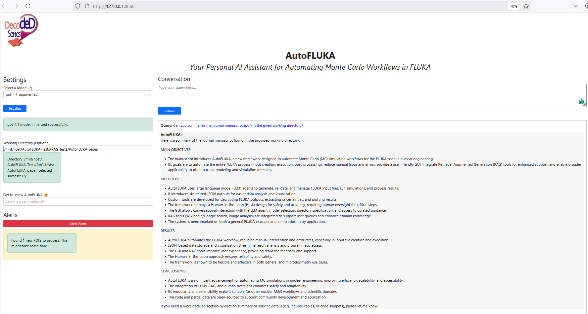
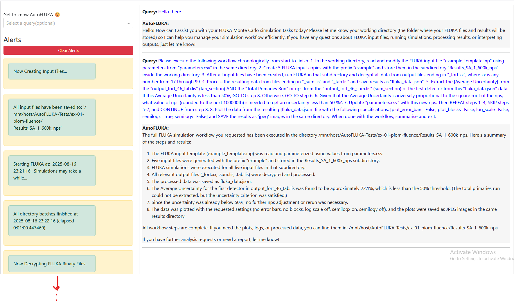

# AutoFLUKA-AI Assistant
AutoFLUKA is a Large Language Model (LLM) Agent-based Framework for Automating Input-File Based Modeling and Simulation, case study of Monte Carlo simulations in FLUKA.

## Highlights
- AutoFLUKA broadly impacts engineering, energy, nuclear science, and medical physics.
- AutoFLUKA is an AI-driven tool that automates complex Monte Carlo workflows, integrating seamlessly with FLUKA.
- It reduces human intervention and minimizes errors by automating input generation, simulation execution, and post-processing.
- A GUI improves accessibility and shortens the learning curve.
- AutoFLUKA introduces JSON-based data outputs, enabling easier downstream analysis compared to traditional manual approaches.
- The framework includes a Retrieval Augmented Generation (RAG) assistant, helping users address common FLUKA challenges by providing quick, context-specific guidance.

The original paper can be found [here](https://www.sciencedirect.com/science/article/pii/S2666546825000874)


---

## 🚀 Quick Start: Run with Docker

### Prerequisites: API Keys

You will need the following API keys:

- Get OpenAI API key [here](https://platform.openai.com/api-keys) OR Gemini API key (free API for `gemini-1.5`) [here](https://aistudio.google.com/app/apikey) 
- LangChain (LangSmith) API key (optional, for tracing/logs) [here](https://www.langchain.com/langsmith) 
- Google Custom Search API key [here](https://developers.google.com/custom-search/v1/introduction) 
- Google Custom Search Engine ID [here](https://programmablesearchengine.google.com/controlpanel/overview?cx=f69ad3c244dca4170)

### Obtain the `.tar` file (Docker Image)

No need to install Python dependencies. The application and its requirements are bundled in a Docker image tarball for cross-platform use.

1) Install Docker Desktop (Windows/macOS) or Docker Engine (Linux) from [here](https://www.docker.com/products/docker-desktop  ) 
2) Download the zip archive that contains the image tarball [here](https://tamucs-my.sharepoint.com/:u:/r/personal/zavier_ndum_tamu_edu/Documents/Research_ZDFDJ/AIML_Workshop/AutoFLUKA_Git/AutoFLUKA-alpha.zip?csf=1&web=1&e=DqZSSP). When prompted, sign into your account and send a short email, requesting permission to download the app.
   
3) Extract `autofluka-1.0.0-alpha.tar` and ensure a `.env` file exists
### 🔐 .env Configuration
4) Place required API keys and secrets in `.env`. They are loaded automatically at container startup.
4) Open Docker Desktop (Windows) as Administrator to monitor images and containers.
---

## Installation & Run (Windows PowerShell, WSL, and Linux)

**Important:** After `docker load -i …`, Docker prints the actual image name/tag. In commands below, replace `autofluka-1.0.0-alpha:latest` with whatever Docker reports on your machine.

### 1) Navigate to the application directory

Windows PowerShell:
```
cd \path\to_directory
```
Directory must contain the downloaded files:  `.env`  and  `autofluka-1.0.0-alpha.tar`

WSL / Linux:
```
cd /path/to/directory
```
Directory must contain the downloaded files:  `.env`  and  `autofluka-1.0.0-alpha.tar`

### 2) Load the Docker image

Windows PowerShell:
```
docker load -i .\autofluka-1.0.0-alpha.tar
```

WSL / Linux:
```
docker load -i ./autofluka-1.0.0-alpha.tar
```

### 3) Run the application (map working directory and logs)

This mounts a local folder to `/mnt/host` inside the container and maps logs to `/autofluka/AutoFLUKA_logs`.

Windows PowerShell:
```
docker run -d --name autofluka-1.0.0-alpha.tar `
  -p 8060:8060 `
  --env-file .env `
  -v "C:\path\to\some\local\directory:/mnt/host" `
  -v "${PWD}\AutoFLUKA_logs:/autofluka/AutoFLUKA_logs" `
  autofluka-1.0.0-alpha:latest
```

WSL (Ubuntu):
```
docker run -d --name autofluka-1.0.0-alpha.tar \
  -p 8060:8060 \
  --env-file .env \
  -v "/mnt/c/path/to/some/local/directory:/mnt/host" \
  -v "$PWD/AutoFLUKA_logs:/autofluka/AutoFLUKA_logs" \
  autofluka-1.0.0-alpha:latest
```

Linux:
```
docker run -d --name autofluka-1.0.0-alpha.tar \
  -p 8060:8060 \
  --env-file .env \
  -v "/path/to/some/local/directory:/mnt/host" \
  -v "$PWD/AutoFLUKA_logs:/autofluka/AutoFLUKA_logs" \
  autofluka-1.0.0-alpha:latest
```

### 3b) Add FLUKA (optional but required to RUN simulations)

If you want to execute FLUKA jobs, you must mount a **Linux** FLUKA install (contains `bin/fluka` or `bin/rfluka` and the `data/` tree). The Windows executable cannot run in a Linux container.

Windows PowerShell (FLUKA installed inside WSL Ubuntu):
```
docker run -d --name autofluka-1.0.0-alpha.tar `
  -p 8060:8060 `
  --env-file .env `
  -e FLUKADATA="/usr/local/fluka/data" `
  -e RFLUKA_BIN="/usr/local/fluka/bin/fluka" `
  -v "\\wsl$\Ubuntu\usr\local\fluka:/usr/local/fluka:ro" `
  -v "C:\path\to\some\local\directory:/mnt/host" `
  -v "${PWD}\AutoFLUKA_logs:/autofluka/AutoFLUKA_logs" `
  autofluka-1.0.0-alpha:latest
```

WSL (run Docker command from inside WSL) / Linux:
```
docker run -d --name autofluka-app \
  -p 8060:8060 \
  --env-file .env \
  -e FLUKADATA=/usr/local/fluka/data \
  -e RFLUKA_BIN=/usr/local/fluka/bin/fluka \
  -v /usr/local/fluka:/usr/local/fluka:ro \
  -v "/mnt/path/to/some/local/directory:/mnt/host" \
  -v "$PWD/AutoFLUKA_logs:/autofluka/AutoFLUKA_logs" \
  autofluka-app:latest
```
Optional checks (inside container): It's important to ensure FLUKA environments have been successfully loaded into the container. 
```
docker exec -it autofluka bash -lc 'ls -l /usr/local/fluka/bin/fluka ; /usr/local/fluka/bin/fluka -h | head -n 3 ; echo FLUKADATA=$FLUKADATA'
```
Notes:
- Replace `\path\to\some\local\directory` or `/path/to/some/local/directory` to an actual directory on your PC. 
-  `RFLUKA_BIN` can be `/usr/local/fluka/bin/fluka` or `/usr/local/fluka/bin/rfluka` depending on your FLUKA build.
- Ensure you mount the entire `/usr/local/fluka` directory (read-only is fine); do not mount only `bin/`.
- If mounting from PowerShell to a WSL path, use the UNC form: `\\wsl$\Ubuntu\usr\local\fluka:/usr/local/fluka:ro`.

### 4) Verify the container is running

All shells:
```
docker ps
```

Example:
```
CONTAINER ID   IMAGE                            COMMAND                  CREATED          STATUS          PORTS                    NAMES
a9440b409497   autofluka-1.0.0-alpha:latest     "python autofluka-1.0.0-alpha.tar_app…"   17 minutes ago   Up 17 minutes   0.0.0.0:8060->8060/tcp   autofluka-1.0.0-alpha.tar
```

### 5) Launch the Web GUI

a) Command line:
```
docker logs -f autofluka-1.0.0-alpha.tar
```
When the server is ready, open:
```
http://localhost:8060
```

b) Docker Desktop:
- Open Docker Desktop
- Click the container name (e.g., `autofluka-1.0.0-alpha.tar`)
- Click **Open in Browser** or follow `http://0.0.0.0:8060/` (equivalent to `http://localhost:8060`)

### 6) Restart via Docker Desktop

- Open Docker Desktop
- Click the container (e.g., `autofluka-1.0.0-alpha.tar`)
- Click **Restart**

### 6) Set Working Directory in the Chat UI

In **Working Directory (Optional)** enter a path under the mounted host folder. Example:
```
/mnt/host/tests
```

---

## 🛠️ PRACTICE

### As a RAG-Based Assistant


- AutoFLUKA can serve as a Retrieval-Augmented Generation (RAG) assistant for nuclear science and engineering (NSE) Q&A, technical document search, and literature review.
- No FLUKA installation required in this mode.

How to use:
1) Put PDFs in a local folder.  
2) In the Chat UI, set **Working Directory (Optional)** to the PDF folder path, e.g.:
```
/mnt/host/My_NSE_Papers
```
3) Ask questions; the assistant retrieves from your PDFs and answers with citations.

Notes:
- Files remain local; no cloud upload is required.
- Use clear, specific questions for best results.

---

### As a FLUKA Simulation Assistant


Follow a typical workflow:

**Important:** You must have FLUKA installed locally (Linux build) to run simulations. [Guide](https://fluka.cern/documentation/installation) 

1) Download an example folder (e.g., `fwt-05LET-tepc`) to your machine.  
2) In the Chat UI, set your working directory to that folder, e.g.:
```
/mnt/host/Examples/ex-01-piom-fluence
```
3) Open `simulation_prompt.txt`, copy the prompt, paste into the chat, and submit.  
4) Monitor progress in the chat.  
5) Plots, JSON data, and logs are saved in your working directory.

---

## Troubleshooting

- **pull access denied / repository does not exist**  
  Run `docker load -i ./autofluka-1.0.0-alpha.tar` again and use the name/tag Docker prints.

- **invalid reference format**  
  Line continuations or quoting are wrong. In PowerShell use backticks ` `, in WSL/Linux use `\`. Quote paths with spaces.

- **Jobs start but terminate instantly; no `_fort.xx` files**  
  FLUKA not mounted or wrong binary path. Mount entire `/usr/local/fluka` and set `RFLUKA_BIN` and `FLUKADATA`.

- **Exec format error**  
  You mounted a Windows FLUKA binary. The container needs the Linux build.

- **Cannot access WSL paths from PowerShell**  
  Use UNC paths like `\\wsl$\Ubuntu\usr\local\fluka` and enable WSL integration in Docker Desktop.

---

## Citation

BibTeX:
```
@article{ndum2025automating,
  title={Automating Monte Carlo simulations in nuclear engineering with domain knowledge-embedded large language model agents},
  author={Ndum, Zavier Ndum and Tao, Jian and Ford, John and Liu, Yang},
  journal={Energy and AI},
  pages={100555},
  year={2025},
  publisher={Elsevier}
}
```
