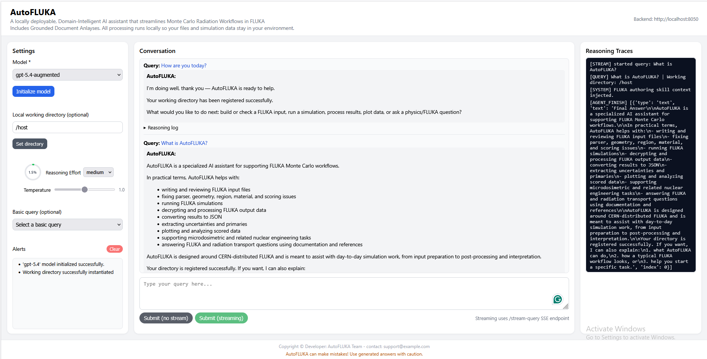
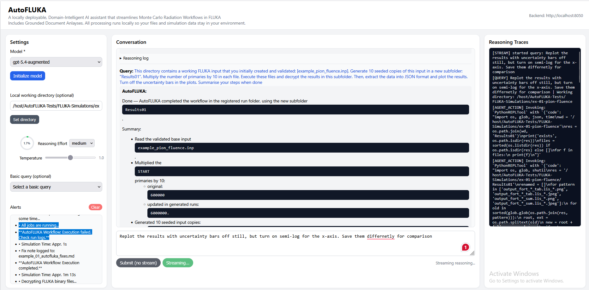

<div align="center">

[](https://github.com/SmartLabNuclear/AutoFLUKA/stargazers)

[](https://www.langchain.com/)
[](https://hub.docker.com/r/zev94/autofluka-2.0)
[](https://github.com/SmartLabNuclear/AutoFLUKA/commits)

### ⭐ If AutoFLUKA is useful to you, please consider starring the repo, it genuinely helps others discover the project.

### 💬 Using AutoFLUKA (or its related tools/papers)? I'd appreciate ~5 minutes of your feedback, it directly shapes what gets prioritized next: [Share your experience](https://forms.gle/bU5th8vfPXdcxbNT9)

</div>

# AutoFLUKA-2.0

- AutoFLUKA is a locally deployable, domain-intelligent LLM agent framework that streamlines and automates Monte Carlo radiation workflows in FLUKA.
- It includes grounded document analysis to deliver accurate, context-aware assistance.
- All processing runs locally, so your documents, inputs, and simulation data remain in your environment.

## Highlights

- AutoFLUKA broadly impacts engineering, energy, nuclear science, and medical physics.
- AutoFLUKA is an AI-driven framework that automates Monte Carlo workflows, from input authoring to simulation execution and post-processing.
- **AutoFLUKA 2.0 adds autonomous FLUKA input generation with or without templates, plus execution-aware self-healing loops that detect failures, adjust inputs, and re-run jobs.**
- This capability is enabled by **FLUKA Skills**: domain-specific, reusable workflow assets (instructions, examples, and execution logic) that guide the agent through robust FLUKA authoring, run orchestration, and error recovery.
- A GUI improves accessibility and shortens the learning curve.
- AutoFLUKA introduces JSON-based outputs and a RAG assistant for fast, context-aware troubleshooting.

The original paper can be found [here](https://www.sciencedirect.com/science/article/pii/S2666546825000874)

---

## Table of Contents

- [Part 1: Prerequisites](#part-1-prerequisites)
- [Part 2: Prepare Your Local Directory](#part-2-prepare-your-local-directory)
- [Part 3: Run AutoFLUKA](#part-3-run-autofluka)
  - [Option 1: Docker Compose (recommended)](#option-1-docker-compose-recommended)
  - [Option 2: Plain `docker run` (legacy)](#option-2-plain-docker-run-legacy)
  - [Verify and Open the UI](#verify-and-open-the-ui)
- [Example Screenshots](#example-screenshots)
- [Troubleshooting](#troubleshooting)
- [Related Projects](#related-projects)
- [News and Updates](#news-and-updates)
- [Citation](#citation)

New here? Start with **Part 1** and come back once your API keys are ready.

---

## Part 1: Prerequisites

### API Keys

You will need the following API keys:

- OpenAI API key (one of OpenAI or Gemini is required, this one needs billing set up): [step-by-step guide](LearningCenter/api-key-guides/openai.md)
- Gemini API key (one of OpenAI or Gemini is required, this one is free): [step-by-step guide](LearningCenter/api-key-guides/gemini.md)
- LangChain (LangSmith) API key (optional, for tracing/logs): [step-by-step guide](LearningCenter/api-key-guides/langsmith.md)
- Hugging Face API key (`HF_API_KEY`, optional, for document parsing in RAG): [step-by-step guide](LearningCenter/api-key-guides/huggingface.md)
- Tavily API key (optional, for live web search): [step-by-step guide](LearningCenter/api-key-guides/tavily.md)
- Google Custom Search API key and Search Engine ID (optional legacy backup, see below): [step-by-step guide](LearningCenter/api-key-guides/google-custom-search.md)

#### Web Search (Optional)

Web search is not required to run FLUKA through AutoFLUKA. It has no effect on the core workflow of input authoring, execution, troubleshooting, and post-processing, all of which AutoFLUKA handles using its built-in domain knowledge and the mounted FLUKA Skills. Web search only adds a live, up-to-date reference and knowledge lookup on top of that, useful when you need current information a static knowledge base cannot provide.

If you want it, AutoFLUKA's live web search runs on Tavily, free, no credit card required. See the [step-by-step Tavily guide](LearningCenter/api-key-guides/tavily.md) for the exact signup steps, including a couple of non-obvious spots in Tavily's own onboarding flow worth knowing about in advance.

If you separately have a working Google Custom Search key from before, you can also set `CUSTOM_SEARCH_ENGINE_API_KEY` and `CUSTOM_SEARCH_ENGINE_ID`. AutoFLUKA will use it automatically as a silent backup whenever Tavily is unavailable, though this is entirely optional, and most new users should skip it. Google closed that API to new customers in 2025 and will shut it down entirely on January 1, 2027. See the [Google Custom Search guide](LearningCenter/api-key-guides/google-custom-search.md) if you already have access from before that cutoff.

### Docker

You will also need [Docker Desktop](https://www.docker.com/products/docker-desktop/) (Windows/macOS) or [Docker Engine](https://docs.docker.com/engine/install/) (Linux).

### The AutoFLUKA Image

Prebuilt images are published on Docker Hub: [`zev94/autofluka-2.0`](https://hub.docker.com/r/zev94/autofluka-2.0). No `.tar` download or access request needed, pull it directly.

- `zev94/autofluka-2.0:2.0` — the original fixed build referenced by the AutoFLUKA paper. Frozen, kept exactly as first published.
- `zev94/autofluka-2.0:latest` — the rolling tag, always the newest build.
- `zev94/autofluka-2.0:YYYY-MM-DD` — a dated snapshot pushed alongside every `:latest` update, for pinning to a specific known build. See the [full tag list](https://hub.docker.com/r/zev94/autofluka-2.0/tags) for available dates.

Both launch methods in [Part 3](#part-3-run-autofluka) pull the image automatically, so you don't need to do this manually, but you can get a head start now if you like:

```bash
docker pull zev94/autofluka-2.0:latest
# or pin a specific dated build instead of the rolling tag:
docker pull zev94/autofluka-2.0:2026-08-21
```

---

## Part 2: Prepare Your Local Directory

With your API keys ready, set up the folders AutoFLUKA reads from and writes to, plus your `.env` file. This is a one-time setup. Do it once, before your first run, regardless of which launch method you pick in Part 3.

### Volume Layout

The container uses these logical areas:

| Area | Container path | Mode | Purpose |
|------|----------------|------|---------|
| FLUKA Skills | `/autofluka/fluka_skills` | read-write | Authoring rules, working examples, troubleshooting knowledge base |
| Logs | `/autofluka/AutoFLUKA_logs` | read-write | Application logs |
| Sessions | `/autofluka/AutoFLUKA_Sessions` | read-write | Persistent chat/session history |
| Working data | `/host` | read-write | Your FLUKA cases, inputs, and outputs |
| FLUKA install *(optional)* | `/usr/local/fluka` | read-only (`:ro`) | Only needed for full simulation execution mode — see [2A/2B](#option-2-plain-docker-run-legacy) below |

**Security note:** whatever folder you mount to `/host` is the *only* folder the agent can read or write. It can create and browse subfolders inside it freely, but it cannot reach anything outside it, including parent directories or other drives. Pick a folder you're comfortable giving AutoFLUKA full read/write access to, nothing more.

### Download the FLUKA Skills Folder

Download `fluka_skills/` from this repository (`AutoFLUKA-2.0/fluka_skills`) into your run directory. This ships with the domain rules, working examples, and troubleshooting knowledge base AutoFLUKA relies on.

### Create the Logs and Sessions Folders

PowerShell:

```powershell
New-Item -ItemType Directory -Force .\AutoFLUKA_logs, .\AutoFLUKA_Sessions | Out-Null
```

Bash / Linux / macOS / WSL:

```bash
mkdir -p AutoFLUKA_logs AutoFLUKA_Sessions
```

### Choose Your Working Directory

AutoFLUKA also needs a folder to read and write your simulation files from. This can be **any existing folder on your machine** — you don't need to create a new one just for AutoFLUKA. You'll point Docker at this folder in Part 3.

### Add Your `.env` File

Create a `.env` file in your run directory and set required API keys/secrets. A key-only template is provided at `AutoFLUKA-2.0/fluka_skills/.env.example` (copy and fill values).

**No space between the `=` and your key values.** Your `.env` file should have the following keys (see the links in [Part 1](#api-keys)):

```
OPENAI_API_KEY=<your_key_value>
GEMINI_API_KEY=<your_key_value>
LANGCHAIN_API_KEY=<your_key_value>
HF_API_KEY=<your_key_value>
TAVILY_API_KEY=<your_key_value>
CUSTOM_SEARCH_ENGINE_API_KEY=<your_key_value>
CUSTOM_SEARCH_ENGINE_ID=<your_key_value>
```

At minimum, provide one of `OPENAI_API_KEY` or `GEMINI_API_KEY`. Everything else is optional.

---

## Part 3: Run AutoFLUKA

With Parts 1 and 2 done, you're ready to start AutoFLUKA. Pick one of the two options below. Docker Compose is recommended for almost everyone.

### Option 1: Docker Compose (recommended)

AutoFLUKA can be started with a single command using the [`docker-compose.yml`](./docker-compose.yml) file included in this repo.

Open `docker-compose.yml` and change the `/host` volume line to your working directory from Part 2:

```yaml
- "C:/path/to/your/working-directory:/host"
```

Then run:

```bash
docker compose up -d
```

The first time you run this, Docker downloads the AutoFLUKA image from Docker Hub, then starts the container in the background.

To pin a specific dated build instead of the newest rolling build, change `zev94/autofluka-2.0:latest` to a dated tag (e.g. `zev94/autofluka-2.0:2026-08-21`) on the `image:` line. See the [full tag list](https://hub.docker.com/r/zev94/autofluka-2.0/tags) for available dates.

**FLUKA execution mode (optional):** by default, `docker-compose.yml` runs AutoFLUKA in chatbot/RAG mode only. To also run actual FLUKA simulations, install FLUKA in your WSL/Linux environment, then uncomment the `FLUKADATA`/`RFLUKA_BIN` environment lines and the FLUKA volume mount in `docker-compose.yml`, and run `docker compose` from your WSL/Linux terminal, not PowerShell (see [Troubleshooting](#troubleshooting) for why).

**Everyday commands:** run these from the same folder. Use `docker compose logs -f` to watch the live logs, `docker compose down` to stop and remove the container, and `docker compose up -d --pull always` to pull the latest image and restart.

Your chat history stays in `AutoFLUKA_Sessions/`, so it survives restarts as long as that folder isn't deleted.

### Option 2: Plain `docker run` (legacy)

<details>
<summary>Docker Compose above is the recommended path. Expand for the equivalent plain <code>docker run</code> syntax.</summary>

Using the folders and `.env` file from Part 2:

#### 2A) Run WITH FLUKA (full simulation mode)

- Use this mode if you want AutoFLUKA to execute FLUKA jobs and decrypt results.
- You must mount a Linux FLUKA installation and provide `FLUKADATA` and `RFLUKA_BIN`.
- **IMPORTANT**: AutoFLUKA does **not** ship with a prebuilt FLUKA package. Users wanting this mode must install FLUKA from the official [website](https://fluka.cern/documentation/installation).

Windows PowerShell:

```powershell
docker run -d --name autofluka-app `
  -p 8050:8000 `
  --env-file ".env" `
  -e FLUKADATA=/usr/local/fluka/data `
  -e RFLUKA_BIN=/usr/local/fluka/bin/rfluka `
  -v "\\wsl$\Ubuntu\usr\local\fluka:/usr/local/fluka:ro" `
  -v "${PWD}\fluka_skills:/autofluka/fluka_skills" `
  -v "${PWD}\AutoFLUKA_logs:/autofluka/AutoFLUKA_logs" `
  -v "${PWD}\AutoFLUKA_Sessions:/autofluka/AutoFLUKA_Sessions" `
  -v "C:\path\to\your\simulation-data:/host" `
  zev94/autofluka-2.0:latest
```

WSL / Linux:

```bash
docker run -d --name autofluka-app \
  -p 8050:8000 \
  --env-file .env \
  -e FLUKADATA=/usr/local/fluka/data \
  -e RFLUKA_BIN=/usr/local/fluka/bin/rfluka \
  -v /usr/local/fluka:/usr/local/fluka:ro \
  -v "$PWD/fluka_skills:/autofluka/fluka_skills" \
  -v "$PWD/AutoFLUKA_logs:/autofluka/AutoFLUKA_logs" \
  -v "$PWD/AutoFLUKA_Sessions:/autofluka/AutoFLUKA_Sessions" \
  -v "/mnt/c/path/to/your/simulation-data:/host" \
  zev94/autofluka-2.0:latest
```

#### 2B) Run WITHOUT FLUKA (chatbot/RAG mode)

Use this mode if you only need AI chat, document-grounded Q&A, and input authoring/editing support. No FLUKA installation mount is required.

Windows PowerShell:

```powershell
docker run -d --name autofluka-app `
  -p 8050:8000 `
  --env-file ".env" `
  -v "${PWD}\fluka_skills:/autofluka/fluka_skills" `
  -v "${PWD}\AutoFLUKA_logs:/autofluka/AutoFLUKA_logs" `
  -v "${PWD}\AutoFLUKA_Sessions:/autofluka/AutoFLUKA_Sessions" `
  -v "C:\path\to\your\working-directory:/host" `
  zev94/autofluka-2.0:latest
```

WSL / Linux:

```bash
docker run -d --name autofluka-app \
  -p 8050:8000 \
  --env-file .env \
  -v "$PWD/fluka_skills:/autofluka/fluka_skills" \
  -v "$PWD/AutoFLUKA_logs:/autofluka/AutoFLUKA_logs" \
  -v "$PWD/AutoFLUKA_Sessions:/autofluka/AutoFLUKA_Sessions" \
  -v "/mnt/c/path/to/your/working-directory:/host" \
  zev94/autofluka-2.0:latest
```

Replace `C:\path\to\your\...` or `/path/to/your/...` with the folders you chose in Part 2. Pin a dated tag (e.g. `zev94/autofluka-2.0:2026-08-21`), or use `zev94/autofluka-2.0:2.0` for the original frozen paper build, instead of `:latest` for a specific known build.

Verify, view logs, stop, and remove:

```bash
docker ps
docker logs -f autofluka-app
docker stop autofluka-app
docker rm autofluka-app
```

</details>

### Verify and Open the UI

Check container:

```bash
docker ps
docker logs -f autofluka-app
```

Open:

```text
http://localhost:8050
```

Stop / remove:

```bash
docker stop autofluka-app
docker rm autofluka-app
```

---

## Example Screenshots

### 1) Simple greeting / app responsiveness



### 2) Simulation workflow example



Additional simulation workflow screenshots are included in this repository:
- `Simulation_example_PionFlunce02.png`
- `Simulation_example_PionFlunce03.png`
- `Simulation_example_PionFlunce04.png`

---

## Troubleshooting

- **First check: terminal must see Docker and FLUKA.**
  Run `docker ps` and `which rfluka`. You should see a running/available Docker setup and a valid FLUKA binary path (for example `/usr/local/fluka/bin/rfluka`).

- **Install FLUKA and export paths before full-simulation mode.**
  Ensure FLUKA is installed, then export:
  - `export PATH=/usr/local/fluka/bin:$PATH`
  - `export FLUKADATA=/usr/local/fluka/data`
  - `export RFLUKA_BIN=/usr/local/fluka/bin/rfluka`

- **WSL/Linux is recommended for full capabilities.**
  AutoFLUKA full execution mode is most reliable when Docker and FLUKA are both visible from the same Linux/WSL terminal — run `docker compose`/`docker run` from that same terminal, not PowerShell, for FLUKA execution mode specifically.

- **pull access denied / repository does not exist**
  Confirm image name/tag, then run `docker pull zev94/autofluka-2.0:latest`.

- **invalid reference format**
  Line continuations or quoting are wrong. In PowerShell use backticks ` `` `, in WSL/Linux use `\`. Quote paths with spaces.

- **Jobs start but terminate instantly; no `_fort.xx` files**
  FLUKA not mounted or wrong binary path. Mount entire `/usr/local/fluka` and set `RFLUKA_BIN` and `FLUKADATA`.

- **Exec format error**
  You mounted a Windows FLUKA binary. The container needs the Linux build.

- **Cannot access WSL paths from PowerShell**
  Use UNC paths like `\\wsl$\Ubuntu\usr\local\fluka` and enable WSL integration in Docker Desktop.

---

## Related Projects

AutoFLUKA is part of a broader ecosystem of domain-specific AI agent frameworks built on a shared foundation:

- **[RADIANT-LLM](https://github.com/SmartLabNuclear/RADIANT_LLM)** — the local-LLM and visual-parser capabilities AutoFLUKA and its sibling projects build on are documented and available standalone here. If you want local-model support or the visual document parser on its own, start there.

---

## News and Updates

- **October 19, 2024:** First AutoFLUKA preprint upload demonstrated the proof-of-concept framework.
  Preprint: [AutoFLUKA: A Large Language Model Based Framework for Automating Monte Carlo Simulations in FLUKA](https://arxiv.org/abs/2410.15222)

- **September 2025:** AutoFLUKA journal paper published in *Energy and AI* (Volume 21, Article 100555).
  Journal article: [Automating Monte Carlo simulations in nuclear engineering with domain knowledge-embedded large language model agents](https://www.sciencedirect.com/science/article/pii/S2666546825000874)

- **March 2026:** Major **AutoFLUKA 2.0** update released with FLUKA Skills for autonomous input generation, execution, and self-healing workflows.

- **August 2026:** FLUKA Skills extended to user-subroutine editing (`SOURCE`, including `source_newgen.f`, `MGDRAW`, `FLUSCW`, `COMSCW`, `USRMED`, `LATTIC`, `UBSSET`, and the `USRINI`/`USROUT`/`USRGLO` family), plus support for user-defined Skills so you can steer AutoFLUKA toward your own lab's conventions. Live [web search](#web-search-optional) now runs on Tavily by default, with Google Custom Search kept as an optional legacy fallback. Setup is also easier: step-by-step API key guides and a one-command Docker Compose launch (see [Part 1](#part-1-prerequisites) and [Part 3](#part-3-run-autofluka)).

---

## Citation

BibTeX:

```
@article{ndum2025automating,
  title={Automating Monte Carlo simulations in nuclear engineering with domain knowledge-embedded large language model agents},
  author={Ndum, Zavier Ndum and Tao, Jian and Ford, John and Liu, Yang},
  journal={Energy and AI},
  pages={100555},
  year={2025},
  publisher={Elsevier}
}
```

Preprint (arXiv) BibTeX:

```
@article{ndum2024autofluka,
  title={Autofluka: A large language model based framework for automating monte carlo simulations in fluka},
  author={Ndum, Zavier Ndum and Tao, Jian and Ford, John and Liu, Yang},
  journal={arXiv preprint arXiv:2410.15222},
  year={2024}
}
```
